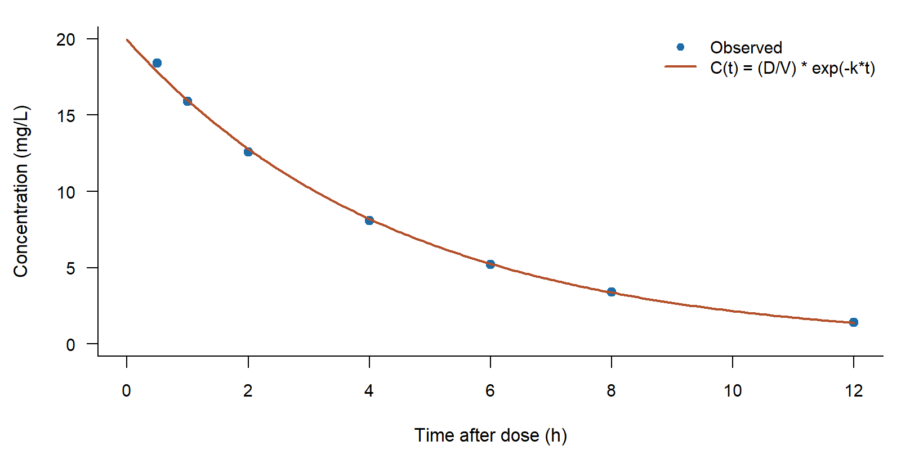

## Agenda

Every example shows **the source you type** and, directly below it, **what it produces**.

1. **Why plain text** — with examples
2. **Markdown essentials**
3. **Documents with Quarto**
4. **Presentations**
5. **Equations**
6. **Your turn** — reproduce a document

## Why plain text?

- **Portable** — a `.qmd` is text; it survives software changes
- **Version-controlled** — every edit is a dated, attributed line in the history
- **Reproducible** — numbers, tables and figures are computed from your input files
- **One source, many outputs** — HTML, PDF, Word, slides
- **Scriptable** — 300 input files become 300 reports

## Version control: what changed, and when

```bash
git diff report.qmd
```

```diff
--- a/report.qmd
+++ b/report.qmd
@@ -12,7 +12,7 @@
-The mean trough was 5.4 mg/L.
+The mean trough was 6.1 mg/L.

-Sampling was pre-dose in all patients.
+Sampling was pre-dose in all but two patients.
```

Two edited lines, both visible, both attributable. A `.docx` is a binary blob: `git diff`
on it says only *Binary files differ*, which is why "track changes" is the best Word
can do.

## Reproducible: numbers come from the input files

````markdown
The mean trough in this cohort is `r mean(conc$c_trough)` mg/L.
````

The mean trough in this cohort is 5.8 mg/L.

Change a value in the input file, re-render, and every number, table and figure that
depends on it updates together. Nobody copies a figure by hand, so nobody copies it
wrongly.

## Anatomy of a `.qmd` file

````markdown
---
title: "Tacrolimus troughs, Q3"
author: "Your Name"
format: html          # html | pdf | docx | revealjs
---

Prose goes here in **Markdown**, including $C_{ss} = R_0 / CL$.

```{r}
mean(c(4.1, 5.6, 6.3))   # runs at render
```
````

**YAML header** — metadata and output settings · **Body** — Markdown · **Code chunks** —
run at render time. Positron ships Quarto: use **Render**/**Preview**, or
`quarto preview slides.qmd`.

::: {.notes}
Positron ships Quarto: the CLI is bundled and the Quarto extension is preinstalled. Quarto
is only a separate install if you work outside Positron.
:::

# Part 1 — Markdown essentials

::: {.notes}
Plain Markdown works everywhere: `.md` files, README files, GitHub comments, Slack, and
Quarto documents.
:::

## Headings create structure

````markdown
# Level 1 — a part of the document
## Level 2 — a section
### Level 3 — a subsection
````

<span style="font-size:1.5em;font-weight:600">Level 1</span> — a part of the document

<span style="font-size:1.25em;font-weight:600">Level 2</span> — a section

<span style="font-size:1.1em;font-weight:600">Level 3</span> — a subsection

::: {.notes}
`#` must start the line, followed by a space. Keep levels in order — do not jump from `#`
to `###`. In a slide format a `##` heading **starts a new slide**, so in this deck headings
are structure, not decoration.
:::

## Text: emphasis, paragraphs, breaks

````markdown
*italic*  **bold**  ***both***  ~~struck~~  `inline code`

A blank line makes a new paragraph. A single line
break inside one is ignored.

End a line with two spaces,  
and you get a hard break.
````

*italic*  **bold**  ***both***  ~~struck~~  `inline code`

A blank line makes a new paragraph. A single line
break inside one is ignored.

End a line with two spaces,  
and you get a hard break.

::: {.notes}
Tip: write one sentence per line. Long paragraphs then diff cleanly in `git`.
:::

## Bulleted lists

````markdown
- Tacrolimus
- Ciclosporin
  - whole blood
  - trough concentration
- Everolimus
````

- Tacrolimus
- Ciclosporin
  - whole blood
  - trough concentration
- Everolimus

::: {.notes}
Nest by indenting the sub-list by **4 spaces**, with a blank line before it. Use `-` or
`*` at the start of the line — pick one and stay consistent.
:::

## Numbered lists

````markdown
1. Draw the trough
1. Centrifuge
1. Freeze the sample
````

1. Draw the trough
2. Centrifuge
3. Freeze the sample

**Quarto numbers the list for you.** The source above writes `1.` on every line and
still renders 1, 2, 3, so inserting an item in the middle never means renumbering by hand.

## Task lists

````markdown
- [x] Ethics approval
- [x] Assay validation
- [ ] Recruit 40 patients
````

- [x] Ethics approval
- [x] Assay validation
- [ ] Recruit 40 patients

::: {.notes}
Task lists are useful for study protocols and to-do slides — they are also how the exercise
sheet tracks the five tasks. A blank line before the list keeps it from being absorbed into
the paragraph above.
:::

## Links and images

````markdown
[Quarto documentation](https://quarto.org)

{#fig-curve}

See @fig-curve.
````

[Quarto documentation](https://quarto.org)

{#fig-curve width=50%}

::: {.notes}
As shown in @fig-curve, the profile decays mono-exponentially — the `@fig-` reference
becomes a number and a link.

A `{#fig-…}` label gives the image a **caption and a number**; `@fig-…` links to it. Size it
with `{width=50%}`. The `@fig-` trick works in documents *and* slides. `<https://quarto.org>`
on its own line is an autolink.
:::

## Tables

````markdown
| Time (h) | Conc. (mg/L) |
|---------:|:------------:|
| 1        | 12.4         |
| 4        | 8.1          |

: Vancomycin concentrations {#tbl-conc}
````

| Time (h) | Conc. (mg/L) |
|---------:|:------------:|
| 1        | 12.4         |
| 4        | 8.1          |

: Vancomycin concentrations {#tbl-conc}

::: {.notes}
`: Caption {#tbl-conc}` adds a caption and a label, so you can write `@tbl-conc`. `---:`
right-aligns, `:--:` centres, `:---` left-aligns. Tables need the `|---|` separator row and
a non-empty header row.
:::

## Quotes and callouts

````markdown
> Quote a guideline, verbatim.

::: {.callout-tip}
## Practical tip
A callout groups advice.
:::
````

> Quote a guideline, verbatim.

::: {.callout-tip}
## Practical tip
A callout groups advice.
:::

Other callout types: `.callout-note`, `.callout-important`, `.callout-caution`,
`.callout-warning`.

## Code blocks

````markdown
Inline code like `CL = D/AUC` sits in a sentence.

```python
auc = sum((c[i] + c[i+1]) / 2 * (t[i+1] - t[i])
          for i in range(len(c) - 1))
```
````

Inline code like `CL = D/AUC` sits in a sentence.

```python
auc = sum((c[i] + c[i+1]) / 2 * (t[i+1] - t[i])
          for i in range(len(c) - 1))
```

Fenced blocks get syntax highlighting and a copy button. To *show* a fenced block, wrap it
in one more backtick — four around three, as this slide does.

## Markdown pitfalls worth knowing on day one

- `*` and `_` are **always** formatting characters: `AUC_MIC` becomes AUC*MIC.
  Write `AUC\_MIC` or `AUC-MIC`.
- One blank line between blocks — two spaces and no blank line will surprise you.
- Do not indent ordinary paragraphs: 4 spaces means "code".
- Front matter only counts at the very top of the file.

::: {.notes}
When something renders oddly, look for a *stray* `*`, `_`, `|`, `$` or a missing blank
line. Half of Markdown debugging is noticing that something did *not* happen.
:::

# Part 2 — Documents with Quarto

::: {.notes}
Plain Markdown gives you formatting. Quarto adds *publishing*: numbering,
cross-references, citations, tables of contents, and code that runs.
:::

## The YAML header — where the document is configured

````markdown
---
title: "Vancomycin AUC monitoring"
subtitle: "Pharmacy department"
author: "Your Name"
date: today
format:
  html:
    toc: true
    number-sections: true
---
````

<span style="font-size:1.25em;font-weight:700;display:block;line-height:1.2">Vancomycin AUC monitoring</span>
<span style="font-size:0.9em;display:block;margin-top:0.15em">Pharmacy department</span>
<span style="font-size:0.8em;display:block;margin-top:0.5em">Your Name · 24 September 2026</span>

::: {.notes}
That title block, the table of contents and the section numbers all come from those ten
lines. YAML is **whitespace sensitive**: two spaces per level, no tabs. If a render fails,
suspect the YAML first — the error message usually names the line. Other options you will
reach for: `code-fold: true`, `execute: echo: false`, `freeze: true` for slow model fits,
`theme: cosmo`, `bibliography: refs.bib`, `embed-resources: true`.
:::

## Parameters: one document, many versions

````markdown
---
title: "Trough report"
params:
  data_file: "data/cohort-a.csv"
  centre: "Oslo University Hospital"
  recipient: "Dr. Smith"
---
````

Use them in the text and in your code as `params$name`:

````markdown
Dear `r params$recipient` — this report is from `r params$centre`.

```{r}
conc <- read.csv(params$data_file)
```
````

## Overriding parameters at render time

```bash
quarto render report.qmd -P centre:"Trondheim"
quarto render report.qmd -P data_file:"data/cohort-b.csv"
```

One source, many versions — a **new input file**, a different **centre**, a **letter** to a
different recipient. No editing, no copies of the document.

## Computed numbers: code chunks

````markdown
The mean trough in this cohort is `r mean(conc$c_trough)` mg/L.

```{r}
#| label: fig-conc
#| fig-cap: "Concentration-time profile."
plot(conc$time, conc$value, pch = 19)
```
````

- `` `r ... ` `` — **inline** code: the value is written into the sentence at render time
- `#| label: fig-conc` — names the figure, so you can write `see @fig-conc`

Never type a number twice: let the document compute it.

::: {.notes}
`exercises/reproduce-target.qmd` is a complete worked example — sections, numbered
equations, a computed figure and a table. Render it with `quarto render` from the
`exercises/` folder; it needs R with `knitr`.
:::

## Cross-references

Annotate the thing itself, then refer to it anywhere else — the numbers are generated.

| Annotate | Reference | Result |
|----------------------------------|----------------|------------|
| `# Methods {#sec-methods}` | `@sec-methods` | Section 2.3 |
| `{#fig-curve}` | `@fig-curve` | Figure 1 |
| `: Caption {#tbl-conc}` | `@tbl-conc` | Table 1 |
| `$$ y = x^2 $$ {#eq-fit}` | `@eq-fit` | Equation 1 |

## Citations in text

````markdown
The `pharmsol` library supports pharmacokinetic and pharmacodynamic
modeling and simulation [@Otálvaro2026].
````

The `pharmsol` library supports pharmacokinetic and pharmacodynamic modeling and simulation [@Otálvaro2026].

The citation key in square brackets becomes a formatted in-text citation.

## The `.bib` file

\begingroup
\scriptsize
```bibtex
@article{Otálvaro2026,
  doi       = {10.21105/joss.10580},
  year      = {2026},
  author    = {Otálvaro, Julián D. and Hovd, Markus
               and Yamada, Walter M. and Neely, Michael},
  title     = {pharmsol: A high-performance Rust library for
               pharmacokinetic and pharmacodynamic modeling and simulation},
  journal   = {Journal of Open Source Software}
}
```
\endgroup

`bibliography: references.bib` in the YAML; `csl: vancouver.csl` picks the style.

## One source, many outputs

```bash
quarto render report.qmd                 # the format in its YAML
quarto render report.qmd --to docx       # for co-authors who live in Word
quarto render report.qmd --to pdf        # needs LaTeX, or --to typst
```

| Output | Use it for | Needs |
|-----------|--------------------------------|--------------|
| HTML | sharing, reading, reproducibility | nothing |
| PDF | submission, print, posters | LaTeX *or* Typst |
| DOCX | co-authors, journals, reviewers | nothing |
| beamer | presentations from `.qmd` | LaTeX |

This deck is the demonstration: `slides.qmd` is one file, and the PDF you are reading is
what it renders to.

# Part 3 — Presentations

## How Markdown becomes slides

| In the file | On the screen |
|--------------------------|------------------------------------------------|
| The YAML header | The title slide |
| `# Part 1 — Essentials` | A **section** divider |
| `## Slide title` | A **new slide** |
| `### Sub-title` | A sub-heading *inside* the slide |

Headings paginate the deck: a `##` you meant as an in-text heading starts a brand new
slide. `slide-level: 3` in the YAML makes `###` start slides too.

## Layout toolkit

| Tool | Syntax |
|--------------------------|--------------------------------------------------|
| Source above result | a fenced block, then the result |
| Two columns | `::: {.columns}` + `::: {.column width="50%"}` |
| Section divider | `# Part 1 — Title` |
| Deeper nesting | `slide-level: 3` makes `###` a slide |

`{.smaller}`, `{.incremental}`, `{.center}` and background colours are **reveal.js only** —
in a PDF they are ignored, silently, with no error. So fit a slide by cutting words rather
than shrinking the type.

## Presenting and exporting

- `quarto render slides.qmd` — builds `slides.pdf`, 16:9, with a footer and page numbers
- `quarto preview slides.qmd` — your rehearsal loop, re-rendering on every save
  (in Positron, the **Preview** button in the action bar does the same)
- `::: {.notes}` blocks are **not** rendered to the PDF. Keep them in the source as your
  script, or delete them — either way the audience never sees them
- A PDF needs a LaTeX toolchain once: `quarto install tinytex`

# Part 4 — Equations

::: {.notes}
Equations are written in **LaTeX syntax** between dollar signs. You type the mathematical
intent; the renderer does the typesetting.
:::

## Inline or display

````markdown
The trough was $C_{min} = 4.2$ mg/L.

$$
C(t) = \frac{D}{V_d}\,e^{-k_e t}
$$
````

The trough was $C_{min} = 4.2$ mg/L.

$$
C(t) = \frac{D}{V_d}\,e^{-k_e t}
$$

`$...$` is **inline** — part of the sentence. `$$...$$` is **display** — its own centred
line.

::: {.notes}
Money is `\$5`; `$ 5` with a space is not treated as math. Count your dollar signs — an
unmatched `$` swallows the rest of the paragraph.
:::

## Symbols: subscripts, fractions, operators

| Type this | You get | Type this | You get |
|---------------------|---------------|----------------------|------------------|
| `x_{ss}`, `x^{2}` | $x_{ss}$, $x^{2}$ | `\frac{a}{b}` | $\frac{a}{b}$ |
| `\ln 2`, `\log_{10}` | $\ln 2$, $\log_{10}$ | `\sqrt{x}` | $\sqrt{x}$ |
| `\sum_{i=1}^{n}` | $\sum_{i=1}^{n}$ | `\int_{0}^{\infty}` | $\int_{0}^{\infty}$ |
| `\lambda_z`, `\mu` | $\lambda_z$, $\mu$ | `\Delta`, `\partial` | $\Delta$, $\partial$ |
| `\geq \leq \neq` | $\geq\ \leq\ \neq$ | `\approx \propto` | $\approx\ \propto$ |
| `\left( \right)` | $\left( \right)$ | `\mathrm{mg/L}` | $\mathrm{mg/L}$ |

::: {.notes}
Braces group things: `C_max` gives C-sub-m followed by "ax", so write `C_{max}`. Functions
are commands: `ln(2)` renders as the italic product, `\ln(2)` renders correctly.
:::

## Multi-line equations with aligned

````markdown
$$\begin{aligned}
C(t) &= C_0 e^{-k_e t} \\
AUC  &= \frac{C_0}{k_e}
\end{aligned}$$
````

$$\begin{aligned}
C(t) &= C_0 e^{-k_e t} \\
AUC  &= \frac{C_0}{k_e}
\end{aligned}$$

`&` marks the alignment point and `\\` ends the line.

## Piecewise equations with cases

````markdown
$$C(t) =
\begin{cases}
\frac{R_0}{CL}\left(1 - e^{-k_e t}\right) & t \le T \\
C_{ss}e^{-k_e (t-T)}                      & t > T
\end{cases}$$
````

$$C(t) =
\begin{cases}
\frac{R_0}{CL}\left(1 - e^{-k_e t}\right) & t \le T \\
C_{ss}e^{-k_e (t-T)}                      & t > T
\end{cases}$$

`cases` gives a piecewise definition — one line per case, condition after `&`.

## Units, spacing and text

````markdown
$C = 8.1\ \mathrm{mg/L}$

$R_0 = 1\ \mathrm{g/h}$

$\text{steady state}$

$95\%$ CI: $7.2$–$9.0$
````

$C = 8.1\ \mathrm{mg/L}$

$R_0 = 1\ \mathrm{g/h}$

$\text{steady state}$

$95\%$ CI: $7.2$–$9.0$

::: {.notes}
`\mathrm{}` for units and multi-letter labels, `\text{}` for words. `\ ` is a normal space,
`\,` a thin one, `\quad` a wide one. Escape `%` as `\%` — unescaped it comments out the rest
of the line. Write `\mu` rather than typing `µ`: the command survives PDF export.
:::

## Numbered equations and cross-references

````markdown
$$
AUC_{0 \to t_n} = \sum_{i=1}^{n-1}
  \frac{C_i + C_{i+1}}{2}\,\Delta t_i
$$ {#eq-auc}

The exposure in @eq-auc is estimated numerically.
````

$$AUC_{0 \to t_n} = \sum_{i=1}^{n-1} \frac{C_i + C_{i+1}}{2}\,\Delta t_i$$

`{#eq-auc}` gives the equation a number; `@eq-auc` links to it as "equation 1".
Renumbering is automatic — add an equation above and every reference follows.

## Equation pitfalls

| Symptom | Cause & fix |
|----------------------------|--------------------------------------------------------|
| `C_max` renders as $C_m$ax | Subscripts need braces: `C_{max}` |
| `ln(2)` renders as $ln(2)$ | Use the command: `\ln(2)` |
| Units come out italic | Wrap them: `\mathrm{mg/L}` |
| The whole paragraph turns into math | Unmatched `$` — count your dollars |
| `%` swallows the rest of the equation | Escape it: `\%` |
| Equation runs off the side of the slide | MathML cannot wrap — split it with `aligned` |

::: {.notes}
Live demo: take a correct equation, delete one brace, re-render, show the error message.
Participants remember the error, not the rule. Equations in this deck are converted at
render time (`html-math-method: mathml`), so a venue with poor Wi-Fi cannot break them.
:::

# Part 5 — Your turn

## Your turn — reproduce a document

**Brief:** [`exercises/task.pdf`](exercises/task.pdf) · **Target:**
[`reproduce-target.pdf`](exercises/reproduce-target.pdf) · **Input:**
[`data/patient-concentrations.csv`](exercises/data/patient-concentrations.csv)

Build a `.qmd` that renders like the target.

- [ ] A YAML header — `title`, `author`, `date: today`, PDF output
- [ ] Numbered sections using `##` headings
- [ ] A paragraph with **bold**, *italic* and an inline equation
- [ ] A **numbered display equation**, labelled and referred to as `@eq-…`
- [ ] An **R code chunk** that reads the CSV and draws a figure
- [ ] That figure **cross-referenced** as `@fig-…`
- [ ] A table with a caption and a label, referred to as `@tbl-…`

Stuck? [`reproduce-solution.pdf`](exercises/reproduce-solution.pdf) is the same document with
every code chunk shown.

## Where to go next

- **This repo**: [`cheatsheet.qmd`](cheatsheet.qmd) — every syntax you saw, on one page
- **Positron**: <https://positron.posit.co> — the IDE, with Quarto built in
- **Quarto**: <https://quarto.org/docs/guide/>
- **Markdown**: <https://commonmark.org/help/>
- **Equations**: <https://en.wikibooks.org/wiki/LaTeX/Mathematics>
- **Symbols**: <https://detexify.kirelabs.org> — draw a symbol, get the command

::: {.notes}
Closing ask: pick ONE document you maintain by hand this month and rebuild it as a `.qmd`.
That is how the habit sticks.
:::

## References {.unnumbered}

::: {#refs}
:::

## Thank you

Questions, or a `.qmd` you want me to look at?

Markus Hovd — Oslo University Hospital

mhovd@ous-hf.no

Slides: `slides.qmd` in this repository — render them yourself and edit them.

::: {.notes}
Leave the last slide up during questions, with the repository name visible so people can
find it later.
:::

<!--END-->
